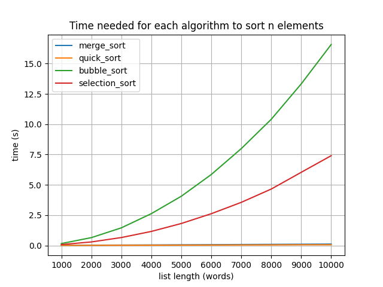

# Link do repozytorium
[https://gitlab-stud.elka.pw.edu.pl/brasztab/brzezinski-rasztabiga-aisdi-lab]()

# Wynikowy wykres


# Przygotowanie wirtualnego środowiska
```bash
pip install virtualenv
virtualenv venv
source venv/bin/activate
```

# Uruchomienie programu
```bash
python main.py pan-tadeusz.txt
```

# Uruchomienie testów
```bash
pytest test_main.py
```

## Podział pracy
Piotr Brzeziński:
- bubble sort
- selection sort
- wykres zależności czasu sortowania od ilości elementów

Bartłomiej Rasztabiga:
- merge sort
- quick sort
- wyliczanie czasu sortowania dla algorytmów
